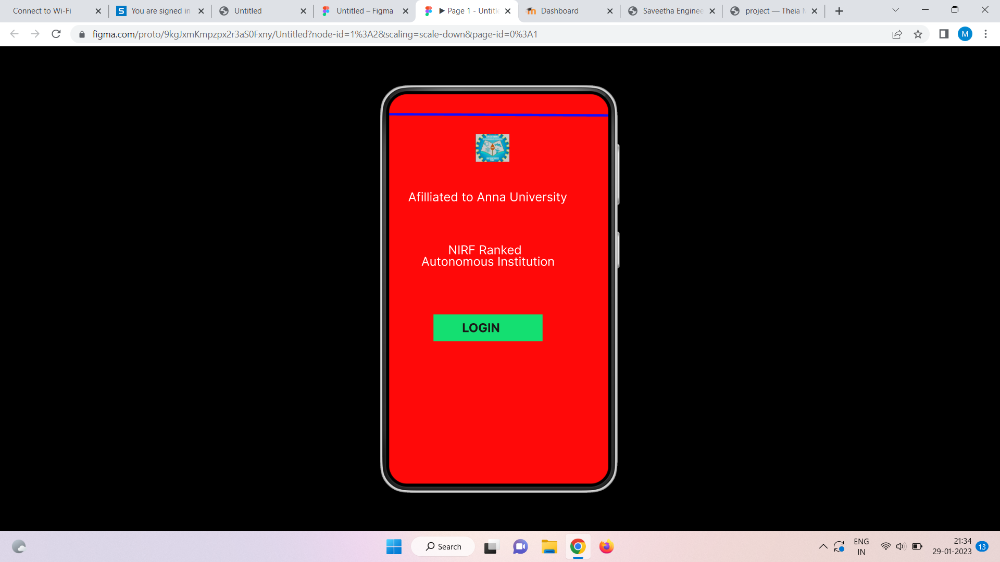
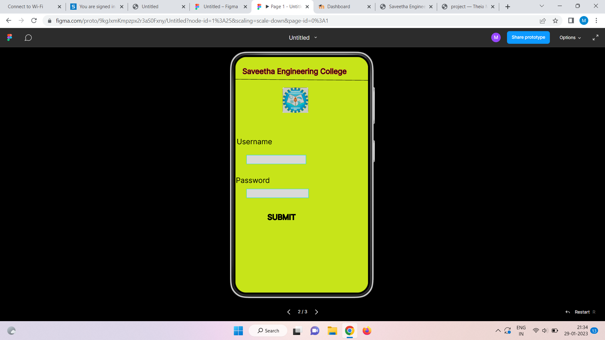
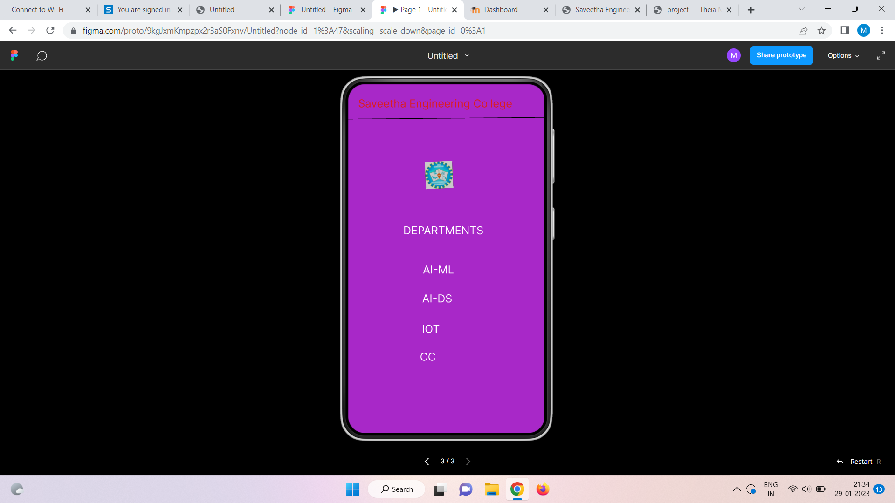

# Event Registration Web Application

## AIM:
To design, develop and deploy a web application for event registration.

## DESIGN STEPS:

### Step 1:
Create a new frame.

### Step 2:
Select any one preset size of your choice.

### Step 3:
Select the shapes you need.

### Step 4:
Import images as needed.

### Step 5:
Create pages based on your need and link them.

### Step 6:

Validate the HTML and CSS code.

### Step 6:

Publish the website in the given URL.

## DESIGN TOOL:
Figma

## code:
```

/* Home Page */


position: relative;
width: 360px;
height: 640px;
background: #FF0909;

/* sec logo 1 */
position: absolute;
width: 1080px;
height: 1062px;

/* Saveetha Engineering College */
position: absolute;
width: 283px;
height: 24px;
font-family: 'Inter';
font-style: normal;
font-weight: 400;
font-size: 20px;
line-height: 24px;
text-align: center;
color: #FFFFFF;

/* Login Page */
position: relative;
width: 360px;
height: 640px;
background: #C7E419;


/* SEC Page */
position: relative;
width: 360px;
height: 640px;
background: #A828C8;
border: 1px solid #CB16DB;
box-shadow: 0px 4px 4px rgba(0, 0, 0, 0.25);
```
## OUTPUT:




## RESULT:
The program to design, develop and deploy a web application for event registration is completed successfully.